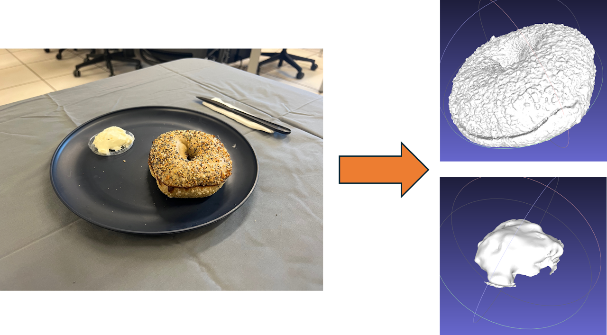
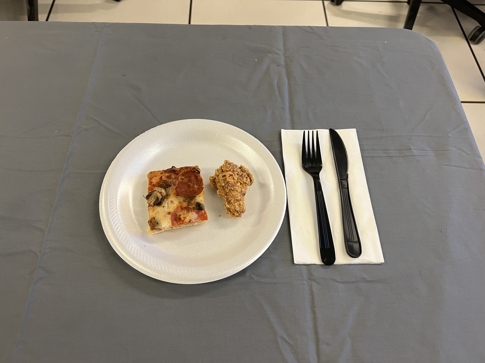
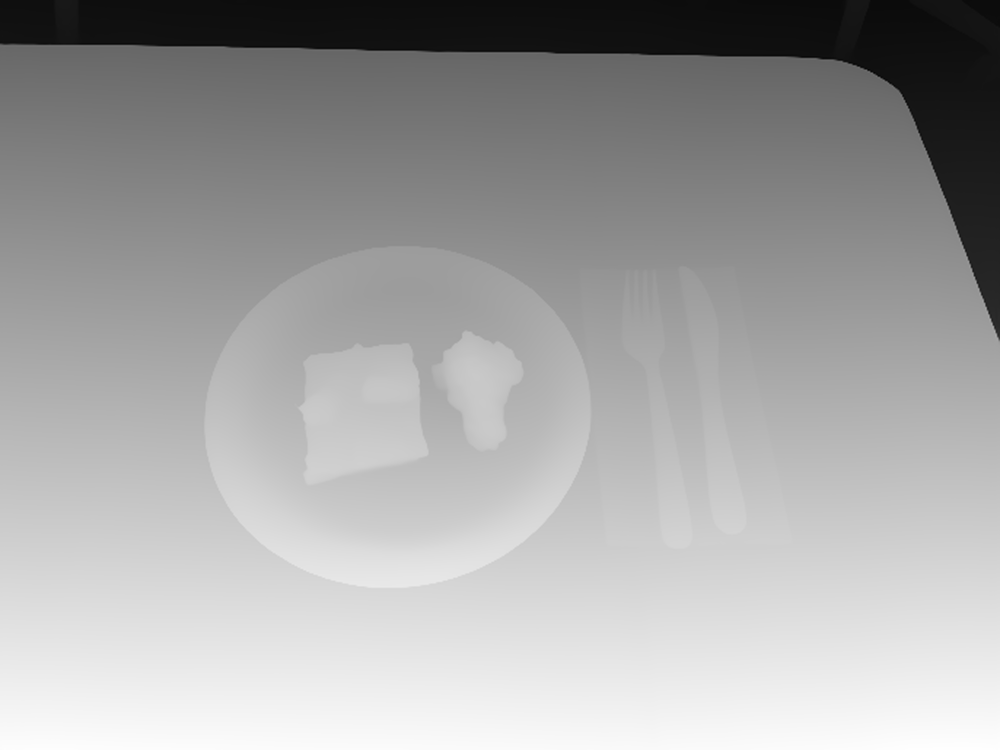
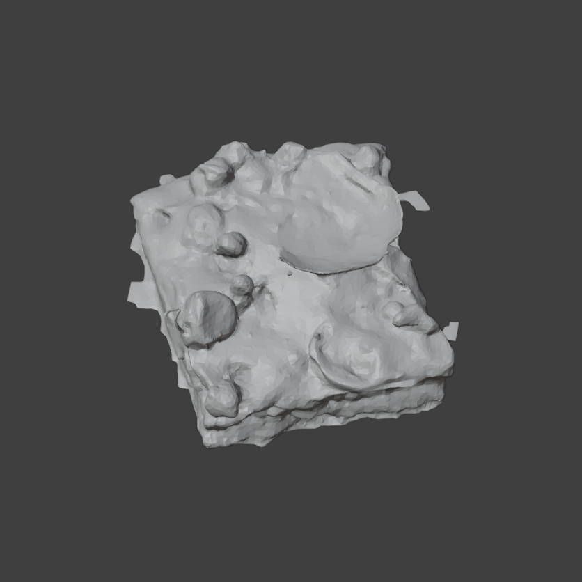
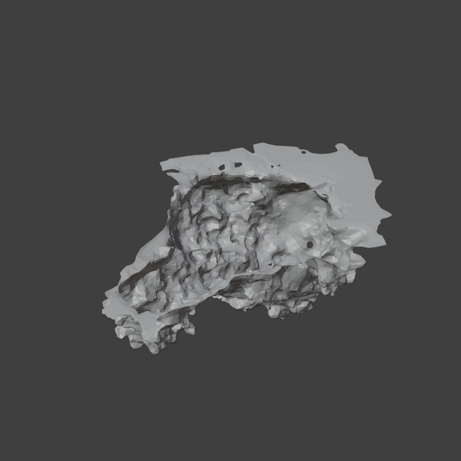

# 3D Reconstruction From Monocular Multi-Food Images

Stack: Python, PyTorch, Plotly, Depth Anything V2, YOLOE, Gemini, TRELLIS, trimesh. See the [full writeup] for a deep dive.

Most volume-estimation pipelines rely on assumptions that real eating-occasion photos break. They expect multiple views, a video sweep, or a reference object placed in the frame for scale. A casual phone photo of a plate gives you one image, mixed and overlapping food items, and no calibration target. **How do you recover metric volume and 3D shape from a single photo of a plate of food?**

> This is a technical write-up of the solution, not usage docs for the current repository. The workflow began as a Colab notebook and is being migrated into modular Python code under src/.

This is my entry for [MetaFood 2025 Challenge 1: 3D Reconstruction From Monocular Multi-Food Images](https://sites.google.com/view/cvpr-metafood-2025/challenge-1). Scoring runs in two phases against 3D-scanner reference models. Phase I evaluates portion-size accuracy using Mean Absolute Percentage Error (MAPE) on predicted volumes. Phase II evaluates shape accuracy for the top Phase I teams using L1 Chamfer Distance following the DTU protocol. The final ranking weights Phase I volume 55% and Phase II shape 45%.

## The Problem

Real images contain occlusion, overlap, shadows, containers, and ambiguous boundaries. Food itself varies widely in color, texture, shape, size, and reflectance. Techniques like photogrammetry and Structure-from-Motion can't infer correct geometry from one image. Fixed-shape and template approaches break because food is rarely uniform.

Two deeper problems sit underneath.

**Unseen geometry:** A monocular image hides the "backside" not captured by the image plane. Projecting voxels downward from the camera over-estimates volume. The error grows as the camera tilt (pitch) flattens toward the surface.

**Camera intrinsics and depth:** You can use the pinhole model with a per-pixel depth-map to produce metric measurements. That works only if the focal length and metric depth are both accurate. EXIF focal length is in millimeters, and it may be missing or wrong. Converting it to pixels needs sensor specs. Casual photos almost never carry simultaneous ground-truth depth. Each of these is a point of failure or noise.

## Workflow

The solution works in five stages:

1. **Depth map generation and scaling.** Relative depth from Depth-Anything-V2-Large, calibrated to metric units downstream.
2. **Segmentation and isolated-object input generation.** Open-vocabulary masks from YOLOE, cleaned and label-corrected.
3. **Focal length estimation via known priors.** Multi-signal fusion of EXIF, plates, and utensils.
4. **Point cloud projection and measurement.** Pinhole projection onto a fitted reference plane to extract a metric footprint.
5. **3D reconstruction via generative mesh models.** TRELLIS meshes scaled to the measured footprint, then volume estimation.

## Key Design Decisions

### 1. Relative Depth, Scene-Calibrated to Metric

**Problem:** Depth models vary widely. Some claim metric output, others return relative depth. Without ground truth, you can't blindly trust metric estimates.

**Decision:** Tested both the metric and non-metric Depth Anything models. Metric estimates were unreliable. They were uniformly off by a large value across the entire image. Values were also well outside common-sense ranges. Relative structure stayed consistent even when absolute depth was wrong. Chose the non-metric Depth Anything V2 Large. Treated output as a relative signal and applied a scaling factor (computed in the focal length stage) to convert to meters.

**Outcome:** A depth field with reliable relative structure. Downstream scene priors can calibrate those values.

How it works:

- Load - Depth-Anything-V2-Large-hf via the Hugging Face transformers pipeline().
- Prediction - Run inference at source resolution.
- Depth-map - Pass the predicted depth array forward for scaling.

[VISUAL: Depth map generation - source/prediction]

### 2. Open-Vocabulary Segmentation with VLM Label Correction

**Problem:** Food images contain overlapping objects, reference items, containers, and table regions. Every downstream step needs object-specific masks. This allows for independent measurement and reconstruction of each food item.

**Decision:** Used YOLOE ([yoloe-11l-seg.pt](http://yoloe-11l-seg.pt)) instead of YOLO11 because it's open-vocabulary and accepts class label inputs. Loading the dataset's food and reference-object labels restricts detection to relevant objects. Each mask becomes an alpha-channel crop for maximum downstream flexibility. YOLOE found the right objects but often picked the wrong label. Rather than fine-tune on a food dataset, correct labels as a post-processing step. A masked crop plus the expected foods for that image is a straightforward visual ID task for a VLM. Send each crop to Gemini 2.0 Flash to return the matching food name.

**Outcome:** Per-object alpha-masked crops with corrected, standardized filenames (food index and name). Downstream mesh outputs match back to dataset rows.

How it works.

- Segmentation - Build class prompts from dataset food names. Add reference objects like plates, bowls, forks, and knives. Keep detections above a 0.35 confidence threshold and uniquely name duplicate classes.
- Cropping - Convert each contour to a binary mask at depth-map resolution. Dilate or erode, and apply it as an alpha channel.
- Clean-up - Skip reference objects and deduplicate overlapping crops before mesh prep.
- Correction - Send each remaining crop to Gemini. Map the returned name back to the dataset row, and rename with a standardized format.

[VISUAL: Pre-correction masked crops. Labels fixed in the Gemini naming step.]

### 3. Multi-Signal Focal Length and Depth Scale Estimation

**Problem:** The pinhole camera model needs focal length in pixels and metric depth in the same scale. EXIF may be missing or wrong, and the dataset supplies no explicit reference objects. Eating scenes contain objects with constrained size distributions, but each signal fails differently. Plates are large and circular, making them good for global scene scale and orientation. They do suffer from size ambiguity though. Utensils have tighter expected dimensions, but they're sensitive to occlusion, angle, and segmentation error. EXIF is convenient, but unverified.

**Decision:** Fuse the sources with uncertainty rather than pick one. Estimate a focal length from each reference object, then assign heuristic confidence scores. Finally, merge with EXIF data. Use the same references to estimate a scaling factor for the depth map's arbitrary units. Support credit-card reference for future use even though the dataset lacks them. The pipeline requires a plate to be present.

**Outcome:** Tolerance for inconsistent depth scaling, partial visibility, extreme viewing angles, multiple reference instances, and mislabeled objects. On the worked example, the final calibrated plate diameter is 23.3cm. This lands within 1.7% of the selected 22.9cm lunch-plate prior.

How it works.

- Reference estimation - focal_length = (size_pixels * distance) / real_world_size, with utensil-type validation by shape analysis and dimension heuristics for unusual angles.
- Depth consistency - Compare median depths across plates and utensils. Apply confidence penalties proportional to inconsistency. Discard utensil estimates when consistency drops below 0.6.
- Confidence weighting - Plates (0.7 to 0.95 with a circularity boost) over utensils (0.8) over EXIF (0.4 to 0.5) over default specs (0.2). Geometric confidence comes from circularity squared, so head-on views are preferred. Depth-consistency penalties reduce utensil confidence by a consistency-squared factor. Knives receive a cubic penalty. Non-independent estimates have their uncertainties inflated by 1.4x before fusion. Outlier detection runs before fusion. Emergency overrides kick in on severe inconsistency. The surviving estimates combine with precision-weighted averaging (1/sigma squared).
- Plate refinement and depth scaling - Fit an ellipse to the plate, estimate circularity and viewing angle, and match to standard plate-size priors. Compare the plate depth distribution against geometric expectations. Then merge scale estimates by confidence.

### 4. Point Cloud Footprint as the Scale Bridge

**Problem:** A projected point cloud only captures visible surfaces. It gives incomplete object dimensions. Why bother projecting one at all?

**Decision:** Project anyway, because with two methods, each covers the other's gap ([see detailed explanation](#Why%20Combine%20Point%20Clouds%20and%20Generative%20Meshes?) ). Generative meshes lack metric scale. Point clouds lack closed volume. Project visible points into 3D using geometric transforms. Remove outliers and fit a reference plane to the plate. Use the XY diagonal (footprint) as the scale target. The reason being, mesh height and depth are unstable and pose-dependent. The visible footprint is more constrained by the image and less sensitive to mesh pose. A diagonal also enables simple widest-dimension verification across coordinate systems. Tried RANSAC for plane fitting first because it's more tolerant of outliers. After mask cleanup and plate-depth regularization, RANSAC and least-squares produced very similar measurements. Kept least-squares because it's simpler, deterministic, and easier to debug.

**Outcome:** A metric footprint per food item that becomes the scale anchor for the generated meshes.

How it works:

- Real-world dimensions - Convert arbitrary depth to metric using the merged scale factor.
- Point cloud creation - Project masked pixels through the pinhole model into camera space.
- Reference plane - Regularize plate points and fit a least-squares plane to the plate.
- Compute dimensions - Project object clouds onto that plane, remove outliers, and compute width, height, and diagonal in meters.
- Validate - Using the reference plane and plate circularity, recover a camera pose. Use plotly to visualize and verify the 3D space.

### 5. Generative Meshes with Layered Volume Fallbacks

**Problem:** Generative meshes come out in an arbitrary coordinate system and scale. They can be inconsistently oriented. They may also have holes, stray vertices, or non-watertight surfaces. These make volume calculation inconsistent. This means inferring rather than observing hidden food geometry.

**Decision:** Generate one mesh per food item with TRELLIS using the corrected alpha-masked crops. Scale each to the measured point-cloud diagonal, clean it, and estimate volume. Exact volume only works on watertight, well-oriented meshes, so use two fallbacks. Voxelization is the primary one. Convex hull volume is the last resort. Both are stable approximations that trade some precision for reliability.

**Outcome:** A closed-volume estimate per food item, metric-scaled to the image evidence. Estimates degrade gracefully when mesh quality is poor.

How it works.

- Generation and conversion - TRELLIS .glb meshes loaded with trimesh, exported to the simpler .obj format. Match to dataset rows by food index and normalized name.
- Metric scaling - Compute the mesh XY diagonal from X/Y extents. Apply a uniform scale factor to match the measured diagonal, and save to meshes/final_obj/.
- Cleanup - Remove Z-axis outlier spikes, fill holes (with aggressive passes for stubborn boundary loops), and add planar caps when still open.
- Volume - Exact watertight volume when possible. Then voxelization (pitch derived from mesh size or fixed), and then convex hull. Convert cubic meters to milliliters and write back to the prediction DataFrame.

[VISUAL: Final scaled pizza mesh]

[VISUAL: Scaled chicken wing mesh before cleanup]

## Results

**Calibration converges close to a real plate size.** On the worked example the system selects a 22.9cm lunch plate. This is consistent with a common 9-inch styrofoam plate. The final raw estimated diameter is 23.3cm. That's roughly a 1.7% calibration error. The projected point-cloud extent is looser. The major projected extent is around 24.6cm, or roughly 7% too large. This points to residual instability between calibration stages and projected measurement geometry. It's not catastrophic scale failure.

Final per-object dimensions (worked example, meters). [Full Debug Trace](#Appendix%20Full%20Debug%20Trace)

Object X Y Diagonal 9-plate 0.2456 0.2218 0.3310 22-chicken_wing 0.0571 0.0745 0.0938 21-pizza 0.0937 0.0953 0.1336

**Scale settles after intermediate drift.** Intermediate stages chose 25.4cm and 20.3cm plate sizes before the final estimate settled on 22.9cm. This is mostly driven by single fixed reference dimensions for utensils. When the real utensil differs from the assumed size, the utensil path can favor a different plate.

## Failure Modes (What Didn't Work Well)

- Bad segmentation propagates through every downstream stage.
- Incorrect food labels break mesh-row matching.
- Plates are ambiguous when heavily cropped or occluded.
- Utensils vary in size and can be partially visible.
- Extreme angles make reference objects unreliable or unidentifiable.
- Generative meshes can invent or omit hidden geometry.
- Voxelized volume depends on pitch and mesh cleanliness.

## Areas for Improvement

I started with an exploratory notebook because the key risk was algorithm design, not software architecture. After validating the approach I began moving toward modules for reproducibility and maintainability. With isolated modules, it will be easier to debug the remaining issues.

The most addressable instability comes from using single fixed reference dimensions for utensils. A utensil-size prior, like plate-sizes, would keep the calibration from hopping between plate sizes. Stage-by-stage logging would make the residual scale drift between calibration and projected measurement easier to trace. The clearest path to lower volume MAPE is reducing the projected extent (7%) error down to the calibrated plate diameter (1.7%) .

## Why Combine Point Clouds and Generative Meshes?

A central design tension shaped the entire pipeline, so it's worth touching on it here.

**What the point cloud gives:** Projecting visible pixels through the pinhole model produces measurements that are constrained by the image and the calibrated scale. The catch is that a monocular view only ever sees one side, so the cloud is an open, incomplete surface. It knows how big, but not the whole shape.

**What the generative mesh gives:** TRELLIS does well at inferring the hidden backside and often returns a closed surface you can integrate for volume. The catch is that it lives in an arbitrary coordinate system at an arbitrary scale. It knows the whole shape, but not how big.

Neither is enough alone, and fortunately their weaknesses are complementary. The point cloud's metric footprint becomes the scale target. The mesh's closed geometry becomes the volume. Using the XY diagonal as the bridge, instead of per-axis extents, keeps the coupling robust to the mesh's unstable pose. The practical takeaway: _when no single representation carries both_ _metric scale and complete geometry, choosing a quantity that each method can agree on is essential_. In this case it's a pose-insensitive footprint diagonal.
